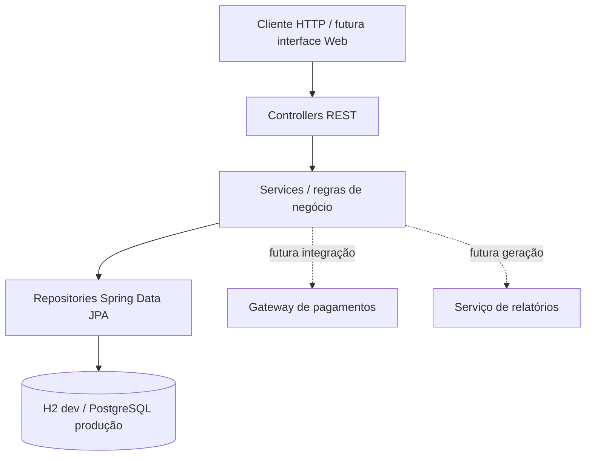

# Arquitectura técnica inicial

```mermaid
flowchart TB
    UI[Cliente HTTP / futura interface Web] --> API[Controllers REST]
    API --> SV[Services / regras de negócio]
    SV --> RP[Repositories Spring Data JPA]
    RP --> DB[(H2 dev / PostgreSQL produção)]
    SV -. futura integração .-> PAY[Gateway de pagamentos]
    SV -. futura geração .-> REP[Serviço de relatórios]
```

A implementação actual cobre catálogo e lotes/stock inicial. Os componentes de pagamentos, relatórios, autenticação e interface ainda não estão implementados.
