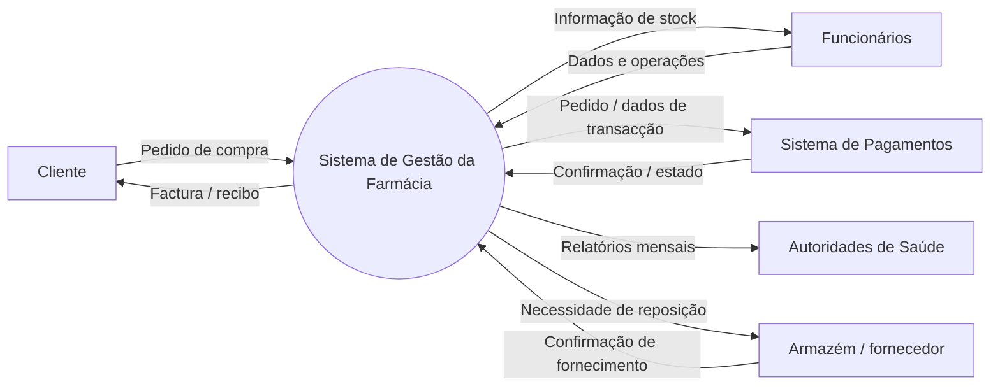

# Diagrama de contexto

```mermaid
flowchart LR
    C[Cliente] -->|Pedido de compra| S((Sistema de Gestão da Farmácia))
    S -->|Factura / recibo| C
    F[Funcionários] -->|Dados e operações| S
    S -->|Informação de stock| F
    S -->|Pedido / dados de transacção| P[Sistema de Pagamentos]
    P -->|Confirmação / estado| S
    S -->|Relatórios mensais| A[Autoridades de Saúde]
    W[Armazém / fornecedor] -->|Confirmação de fornecimento| S
    S -->|Necessidade de reposição| W
```

Representação conceptual baseada nas entidades e fluxos descritos na prova. A fronteira e os fluxos devem ser refinados durante a modelação detalhada.
